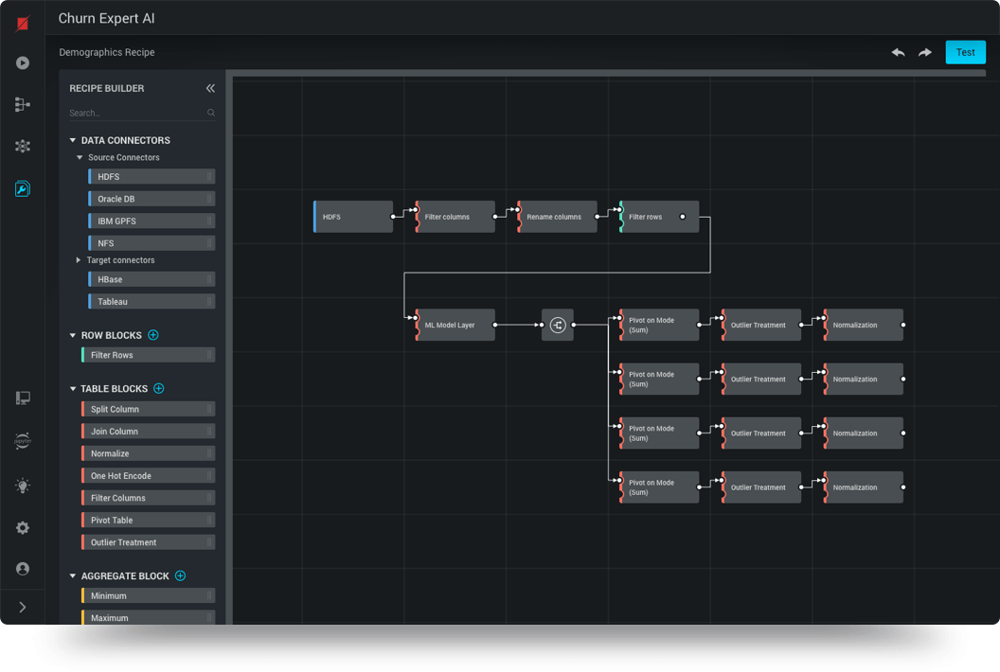

# Pipeline

Welcome to the User manual for Razorthink AI. Whether you are novice or a advance user. Explain how users can access this as demo project in ai.razorthink.com

## Block Inputs
Every block has a well defined input, output and parameters. Input (one or more) is usually a stream of data from a datasource such as HDFS, MySQL or even cloud storage such as Google Drive or Dropbox.

## Block Output
Output of a block is also usually a stream of data that can flow into another block as input or to a destination such any datasource metioned earlier.

## Block Parameters
A block can receive one or more parameters either dynamically during runtime or static during design. 
The following types or parameters are supported out-of-the-box:

<iframe width="560" height="315" src="https://www.youtube.com/embed/Hz3d68G_FVY" frameborder="0" allow="accelerometer; autoplay; encrypted-media; gyroscope; picture-in-picture" allowfullscreen></iframe>

A more detailed description of the video if that is required. Use this space to describe concepts specific to the video. Also use images to further explain the video.
Remind users that the demo project is read-only and can be edited by cloning it to gain ownership over the project.
<!--stackedit_data:
eyJoaXN0b3J5IjpbLTQ4OTQ1ODI0MV19
-->